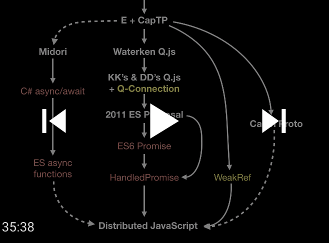

## `Promise.delegated`

*API support for distributed promise pipelining.*

   * Mark S. Miller @erights, Agoric
   * Michael FIG @michaelfig, Agoric
   * Chip Morningstar @FUDCo, Evernote

## Status

Presented to TC39 (Javascript standards committee), achieving stage 1.  (Note that the actual
API has been changed since this talk, to using `Promise.delegated` and other `Promise` static methods
instead of a new `HandledPromise` global.)

[](https://www.youtube.com/watch?v=UXR0O-CufTk&list=PLzDw4TTug5O0ywHrOz4VevVTYr6Kj_KtW)

[Slides](https://github.com/tc39/agendas/blob/master/2019/10.eventual-send-as-recorded.pdf)


## Background

Promises were invented in the late 1980s, originally as a technique for
compensating for roundtrip latency in operations invoked remotely over a
network, though promises have since proven valuable for dealing with all manner
of asynchronous delays in computational systems.

The fundamental insight behind promises is this: in the classic presentation of
object-oriented programming, an object is something that you can send messages
to in order to invoke operations on it.  If the result of such an operation is
another object, that result in turn is something that you can send messages to.
If the operation initiated by a message entails an asynchronous delay to get
the result, rather than forcing the sender to wait (possibly a long time) for
the result to eventually become available, the system can instead immediately
return another object - a promise - that can stand in for the result in the
meantime.  Since, as was just said, an object is something you send messages
to, a promise is, in that respect, potentially as good as the object it is a
promise for -- you simply send it messages as if it was the actual result.

The
promise can't perform the invoked operation directly, since what that means is
not yet known, but it *can* enqueue the request for later processing or relay
it to the other end of a network connection where the result will eventually be
known.  This deferral of operations through enqueuing or relaying can be
pipelined an arbitrary number of operations deep; it is only at the point where
there is a semantic requirement to actually see the result (such as the need to
display it to a human) that the pipeline must stall to await the final outcome.
Furthermore, experience with this paradigm has shown that the point at which
such waiting is truly required can often be much later in a chain of
computational activity than many people's intuitions lead them to expect.

Since network latency is often the largest component of delay in a remotely
invoked operation, the overlapping of network transmissions that promise
pipelining makes possible can result an enormous overall improvement in
throughput in distributed systems.  For example, implementations of promise
pipelining for remote method invocation in the [Xanadu hypertext
system](http://udanax.xanadu.com/gold/) and in Microsoft's [Midori operating
system](http://joeduffyblog.com/2015/11/03/blogging-about-midori/) measured
speedups of 10 to 1,000 over traditional synchronous RPC, depending on use
case.

Promises in JavaScript were proposed in the 2011 [ECMAScript strawman
concurrency
proposal](https://web.archive.org/web/20161026162206/http://wiki.ecmascript.org/doku.php?id=strawman:concurrency).
These promises descend from the [E language](http://erights.org/) via the
[Waterken Q library](http://waterken.sourceforge.net/web_send/) and [Kris
Kowal's Q library](https://github.com/kriskowal/q).  A good early presentation
is Tom Van Cutsem's [Communicating Event Loops: An exploration in
JavaScript](http://soft.vub.ac.be/~tvcutsem/talks/presentations/WGLD_CommEventLoops.pdf).
All of these efforts introduced promises as a first step towards distributed
computing, with the goal of using promises as asynchronous references to remote
objects.  However, since the JavaScript language itself does not contain any
intrinsic I/O machinery, relying entirely on the host environment for this,
Promises as JavaScript currently defines them are not by themselves sufficient
to realize the distributed computation vision that originally motivated them.

Kris Kowal's [Q-connection library](https://github.com/kriskowal/q-connection)
extended Q's promises for distributed computing with [promise
pipelining](https://capnproto.org/rpc.html), essentially in the way we have in
mind.  However, in the absence of platform support for [Weak
References](https://github.com/tc39/proposal-weakrefs), this approach was not
practical.  Given weak references, the [Midori
project](http://joeduffyblog.com/2015/11/19/asynchronous-everything/) and
[Cap'n Proto](https://capnproto.org/rpc.html), among others, demonstrate that
this approach to distributed computing works well at scale.

## Summary

This proposal adds *eventual-send* operations to JavaScript Promises, to express
invocation of operations on potentially remote objects.  We introduce the notion
of a *delegated Promise*, which may have a handler to provide alternate
eventual-send behavior.  We also introduce the concept of *Presences*, which may
also have handlers, but are not promises.  These mechanisms, together with weak
references, enable the creation of remote object communications systems, but
without committing to any specific implementation.  In particular, this proposal
specifies a general mechanism for hooking in whatever host-provided remote
communications facilities are at hand, without constraining the nature of those
facilities.

This proposal does not mandate any specific usage of the mechanisms it
describes.  Such usages as are mentioned here are provided as explanatory and
motivating examples and as ways testing the adequacy of the design, rather than
proposing a particular implementation of remote messaging.


## Design Principles

1. Support *promise pipelining* to reduce the cost of network latency.
1. Prevent reentrancy attacks (a form of plan interference).

## Details

To specify eventual-send operations and delegated promises, we follow the pattern
used to incorporate proxies into JavaScript:  That pattern specified...

   * ***internal methods*** that all objects must support.
   * ***static methods*** on `Reflect` for invoking these internal methods.
   * ***invariants*** that these methods must uphold.
   * ***default behaviors*** of these methods for normal (non-exotic) objects.
   * ***handler traps***. Proxies implement these methods by delegating most of their behaviors to corresponding traps on their handlers.
   * ***proxy invariant enforcement***. The remaining behavior in the proxy methods to guarantee that these invariants are upheld despite arbitrary behavior by the handler.
   * ***fallback behaviors*** for absent traps, implemented in terms of the remaining traps.

Following this analogy, this proposal adds internal eventual-send methods to all
promises, provides default behaviors for undelegated promises, and introduces
delegated promises whose handlers provide traps for these methods.

A new static method, `Promise.delegated`, enables the creation of delegated
promises. The static methods below are static methods of this maker, that is,
`Promise.delegated.eventualGet`, etc:

| Internal Method | Static Method |
| --- | --- |
| `p.[[EventualGet]](prop, opts)`       | `eventualGet(p, prop, opts = {})` |
| `p.[[EventualApply]](args, opts)`     | `eventualApply(p, args, opts = {})` |
| `p.[[EventualSend]](prop, args, opts)`| `eventualSend(p, prop, args, opts = {})` |

The static methods first do a `Promise.resolve` on their first
argument, to coerce it to a promise with these internal methods.  Thus, for
example,

```js
Promise.delegated.eventualGet(p, prop)
```
actually does the equivalent of
```js
Promise.resolve(p).[[EventualGet]](prop, {})
```

Via the internal methods, the static methods cause either the default behavior,
or, for delegated promises, the behavior that calls the associated handler trap.

| Static Method | Default Behavior | Handler trap |
| --- | --- | --- |
| `eventualGet(p, prop, opts)` | `p.then(t => t[prop])` | `h.eventualGet(t, prop, { opts })` |
| `eventualApply(p, args, opts)` | `p.then(t => t(...args))` | `h.eventualApply(t, args, { opts })` |
| `eventualSend(p, prop, args, opts)` | `p.then(t => t[prop](...args))` | `h.eventualSend(t, prop, args, { opts })` |

To protect against reentrancy, the proxy internal method postpones the
execution of the handler trap to a later turn, and immediately returns a
promise for what the trap will return.  For example, the [[EventualGet]] internal
method of a delegated promise is effectively

```js
p.then(t => h.eventualGet(t, prop, { opts }))
```

### `E` convenience proxy maker

Probably the most common distributed programming case, invocation of remote
methods with or without requiring return results, can be implemented by
powerless proxies.  All authority needed to enable communication between the
peers can be implemented in the delegated promise infrastructure.

The `E(target)` proxy maker wraps a target (which may or may not be remote) and
allows for a single remote method call returning a promise for the result.

```js
E(target).method(arg1, arg2...) // Promise<result>
```

Example usage:

```js
import { E } from '@agoric/far';

// Invoke pipelined RPCs.
const fileP = E(
  E(target).openDirectory(dirName)
).openFile(fileName);
// Process the read results after a round trip.
E(fileP).read().then(contents => {
  console.log('file contents', contents);
  // We don't use the result of this send.
  E(fileP, { _oneway: true }).append('fire-and-forget');
});
```

### `Promise.delegated` function

In a manner analogous to *Proxy* handlers, a **delegated promise** is associated
with a handler object.

```js
new Proxy(target, handler) -> fresh proxy

new Promise((resolve, reject) => {
  ...
  resolve(resolution) -> void
  reject(reason) -> void
  ...
}) -> fresh undelegated promise


Promise.delegated((resolve, reject, resolveWithPresence) => {
  ...
  resolve(resolution) -> void
  reject(reason) -> void
  resolveWithPresence(presenceHandler) -> fresh presence
  ...
}, unfulfilledHandler) -> fresh delegated promise
```

For example,

```js
const delegatedExecutor = async (resolve, reject, resolveWithPresence) => {
  // Do something that may need a delay to complete.
  const { err, presenceHandler, other } = await determineResolution();
  if (presenceHandler) {
    // presence is a freshly-created Object.create(null) whose handler
    // is presenceHandler.  The targetP below will be resolved to this
    // presence.
    const presence = resolveWithPresence(presenceHandler);
    presence.toString = () => 'My Special Presence';
  } else if (err) {
    // Reject targetP with err.
    reject(err);
  } else {
    // Resolve targetP to other, using other's handler if there is one.
    resolve(other);
  }
};

// Create a delegated promise with an initial handler.
// A pendingHandler could speculatively send traffic to remote hosts.
const targetP = new Promise.delegated(delegatedExecutor, pendingHandler);
E(E(targetP).remoteMethod(someArg, someArg2)).callOnResult(...otherArgs);
```

The handlers are not exposed to the user of the delegated promise, so it
provides a secure separation between the unprivileged client (which uses the `E`
proxy maker or static `Promise.delegated` methods) and the privileged system
which implements the communication mechanism.

### `Promise.prototype`

Since delegated promises are still Promises, they can be used anyplace a
Promise can.  However, with the additional semantics of `Promise.resolve`,
it is possible to detect if an object is a presence.


### Handler traps

A handler object can provide handler traps (`eventualGet`, `eventualApply`,
`eventualSend`).

```ts
({
  eventualGet        (target, prop, modifiers):        Promise<result>,
  eventualApply      (target, args, modifiers):        Promise<result>,
  eventualSend       (target, prop, args, modifiers):  Promise<result>,
})
```

If the handler omits a trap, invoking the associated operation returns a promise
rejection.  The only exception to that behaviour is if the handler does not
provide the `eventualSend` optimization trap.  Then, its default implementation
is
```js
Promise.delegated.eventualApply(Promise.delegated.eventualGet(p, prop), args, opts)
```

This expansion requires that the promise for the remote method be unnecessarily
reified.

For a pending handler, the trap's `target` argument is the unsettled delegated
promise, so that the handler can gain control before the promise is resolved.
For a presence handler, the trap's `target` argument is the presence that was
created by `resolveWithPresence`.

### `Promise.delegated` static methods

The methods in this section are used to implement higher-level communication
primitives, such as the `E` proxy maker.

These methods are analogous to the `Reflect` API, but asynchronously invoke a
delegated promise's handler regardless of whether the target has resolved.  This
is necessary in order to allow pipelining of messages before the exact
destination is known (i.e. before the delegated promise is resolved).

```js
Promise.delegated.eventualGet(target, prop, opts = {}); // Promise<result>
Promise.delegated.eventualApply(target, [...args], opts = {}); // Promise<result>
```

The `eventualSend` call combines property lookup with function application in
order to distinguish them from an `eventualGet` whose value is separately
inspected, and for the handler to be able to bundle the two operations as a
single message.

```js
Promise.delegated.eventualSend(target, prop, args, opts = {}); // Promise<result>
```

### Opt-In/Opt-Out Modifiers

The last argument of the handler trap is called `modifiers`, and it is
constructed as follows:

- Modifier properties that can be safely ignored (opt-in modifiers) must begin
  with an underscore (`_`).
- All other (required, non-underscore, opt-out) modifier properties must be
  examined and if they are unrecognized by the promise's handler, must result in
  a rejected promise.
- Any caller-supplied `opts` (defaulting to an empty object `{}`), is made
  available as `modifiers.opts`.  The same convention applies; `opts` that are
  safe to ignore must begin with an underscore.
- Other immediate properties of the `modifiers` are implementation-defined.
- The `Promise.delegated` implementation should enforce that the required
  modifiers are examined by the handler trap.  The implementation should reject
  the result promise if any required `modifiers` or `modifiers.opts` property is
  not read.

These conventions help distinguish between modifiers that are optional
optimization hints versus required changes to behaviour.  For example,
`modifiers.opts._oneway` can be safely ignored, since it is not strictly
necessary for correctness, but `modifiers.opts.after` cannot be ignored.

## Platform Support

All the above behavior, as described so far, will be implemented in the [Eventual
Send Shim](https://github.com/Agoric/agoric-sdk/tree/master/packages/eventual-send).
However, there is one critical behavior that we specify, that can easily be
provided by a conforming platform, but is infeasible to emulate on top of
current platform promises.  Without it, many cases that should pipeline do not,
disrupting desired ordering guarantees. Consider:

```js
let pResolve;
const p = new Promise(r => pResolve = r);
E(p).foo();
let qResolve;
const q = new Promise.delegated(r => qResolve = r, qPendingHandler);
pResolve(q);
```

After `p` is resolved to `q`, the delayed `foo` invocation should be forwarded
to `q` and trap to `q`'s `qPendingHandler`.  Although a shim could monkey patch
the `Promise` constructor to provide an altered `resolve` function which does
that, there are plenty of internal resolution steps that would bypass it.  There
is no way for a shim to detect that unsettled undelegated promise `p` has been
resolved to unsettled delegated `q` by one of these.  Instead, the `foo`
invocation will languish until a round trip fulfills `q`, thus
   * losing the benefits of promise pipelining, and
   * potentially arriving after other messages when it really should have
     arrived before them.

## Syntactic Support

A separate [Wavy Dot Proposal](https://github.com/Agoric/proposal-wavy-dot)
proposes a more convenient syntax for calling the new internal methods proposed
here.  However, the eventual-send API described here is valuable even without
the wavy dot syntax.

## Completing the Proxy Analogy

   * ***internal methods*** that all promises must support
      * [[EventualGet]],
      * [[EventualApply]],
      * [[EventualSend]]
   * ***static methods*** on `Promise.delegated` for invoking these internal methods.
      * `Promise.delegated.eventualGet`,
      * `Promise.delegated.eventualApply`,
      * `Promise.delegated.eventualSend`,
   * ***invariants*** that these methods must uphold.
      * Safety from reentrancy.
      * `p === Promise.resolve(t)` vs `p.then(t => ...)`
   * ***default behaviors*** of these methods for undelegated promises to normal objects.
      * `p~.foo` ==> `p.then(t => t.foo)`
      * `p~.(x)` ==> `p.then(t => t(x))`
      * `p~.foo(x)` ==> `p.then(t => t.foo(x))`
   * ***handler traps***. Proxies implement these methods by delegating most of their behaviors to corresponding traps on their handlers.
      * `p~.foo` ==> `p.then(t => h.eventualGet(t, 'foo'))`
      * `p~.(x)` ==> `p.then(t => h.eventualApply(t, [x])`
      * `p~.foo(x)` ==> `p.then(t => h.eventualSend(t, 'foo', [x])`
   * ***promise invariant enforcement***.
      * The `p.then` pattern above
   * ***fallback behaviors*** for absent traps, implemented in terms of the remaining traps.
      * `h.eventualSend(t, 'foo', [x])` defaults to
        `h.eventualApply(t, h.eventualGet(t, 'foo'), [x])`
